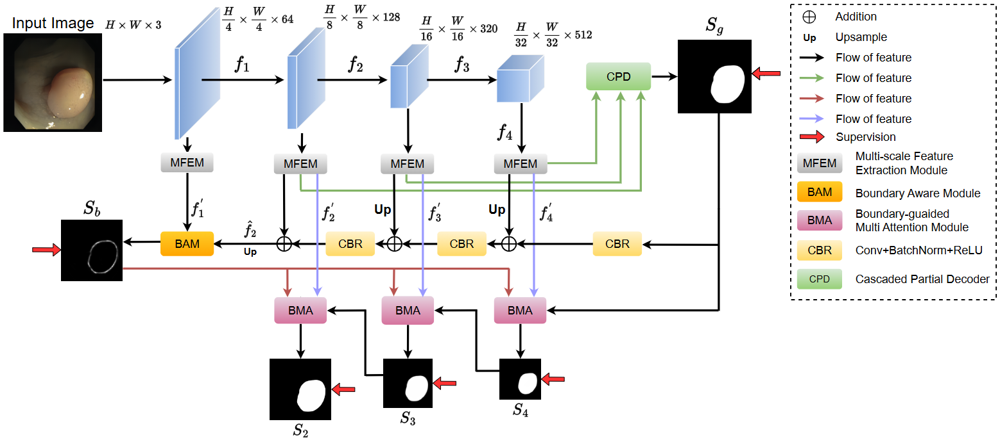

## [BSPC 25] [BMANet: Boundary-guided multi-level attention network for polyp segmentation in colonoscopy images](https://www.sciencedirect.com/science/article/abs/pii/S1746809425000357)
Zihuang Wu, Hua Chen, Xinyu Xiong, Shang Wu, Hongwei Li and Xinyu Zhou

## Introduction
Automated and accurate polyp segmentation is essential for assisting physicians in identifying polyps during colonoscopy, playing a key role in preventing and diagnosing colorectal cancer. Despite significant advances in deep learning-based polyp segmentation methods in recent years, several challenges remain. The shape, size, and texture of polyps can vary considerably, complicating the development of a universal approach. Moreover, polyps are often obscured within the surrounding mucosa, making accurate delineation of their boundaries difficult. To address these challenges, we propose the Boundary-guided Multi-level Attention Network (BMANet) for polyp segmentation. Our method begins with a Cascaded Partial Decoder (CPD) that aggregates high-level semantic features, generating a coarse global feature map. To refine these features, we introduce a Boundary Aware Module (BAM) that combines low-level and global features to produce distinct boundary features. Furthermore, we present a Boundary-guided Multi-level Attention (BMA) module that integrates encoder features, fine boundary features from BAM, and output features from adjacent higher levels. This integration enhances the network’s attention to both polyp regions and boundaries, ensuring comprehensive consideration of global information and boundary details. Through these mechanisms, BMANet effectively identifies polyp regions and yields segmentation results with precise boundaries. Extensive quantitative and qualitative experiments demonstrate that BMANet is highly competitive with existing state-of-the-art (SOTA) methods.


## Citation and Star
Please cite the following paper and star this project if you use this repository in your research. Thank you!
```
@article{wu2025bmanet,
  title={BMANet: Boundary-guided multi-level attention network for polyp segmentation in colonoscopy images},
  author={Wu, Zihuang and Chen, Hua and Xiong, Xinyu and Wu, Shang and Li, Hongwei and Zhou, Xinyu},
  journal={Biomedical Signal Processing and Control},
  volume={105},
  pages={107524},
  year={2025},
  publisher={Elsevier}
}
